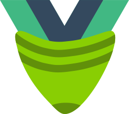

<p align="center" style="margin: 4rem">
  <a href="https://pinia.vuejs.org" target="_blank" rel="noopener noreferrer">
    
  </a>
  <h1 align="center">VueSock</h1>
  <h3 align="center">A GreenSock for Vue</h3>
  <p>.</p>
</p>

Vue wrapper for GreenSock Animation Platform (GSAP)

- **🧮 In-template tweens** <br />
  Use GSAP components in your template

- **✨ Reactive animations** <br />
  Don't worry about updating animations manually

- **🎼 Composition API** <br />
  Use composables if you prefer more programmatic approach

> 
> **This project is in very early stage of development and is not fit for production use**
> 

## 📦 Installation
VueSock is GSAP-version agnostic and should work with any version you throw into your project. 

```sh
// with npm
$ npm install gsap vue-sock

// or with yarn
$ yarn add gsap vue-sock

// or with pnpm
$ pnpm add gsap vue-sock
```

## 🗺 Development progress
The roadmap is published on 
[GitHub Projects](https://github.com/users/JoJk0/projects/1).


Once implemented, [Netlify](https://www.netlify.com/) is expected to be used for deployment and the docs will be plugged into [Algolia](https://www.algolia.com/) search engine.

## 💖 Funding

Help support my open-source work through [PayPal](https://paypal.com) and [GitHub Sponsors](https://github.com/sponsors/JoJk0?o=esb).

<a href="https://www.paypal.com/donate/?hosted_button_id=MVYGX9EHYRN9W"></a>
